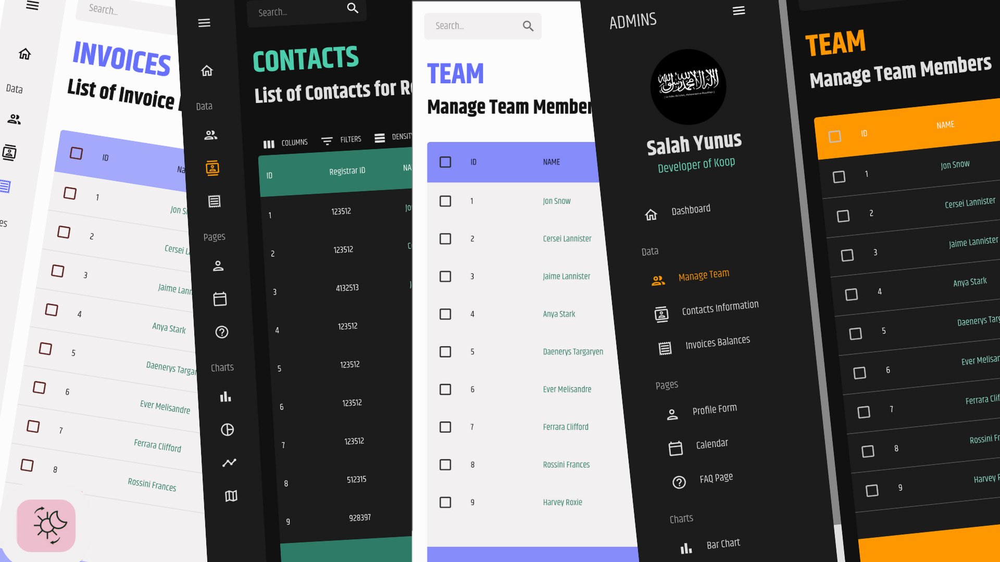
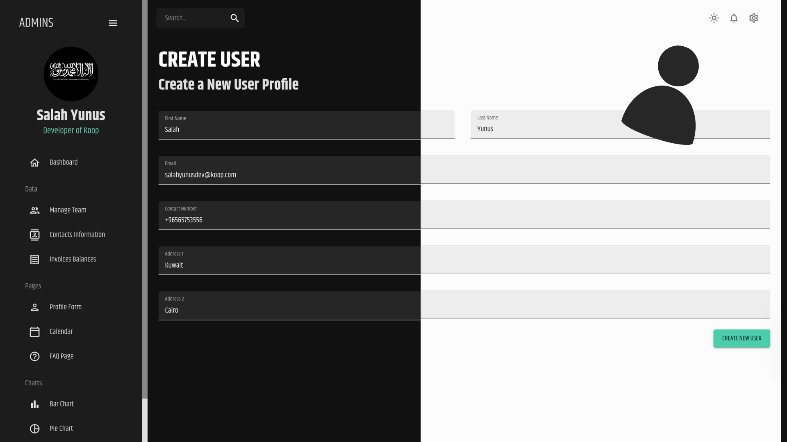
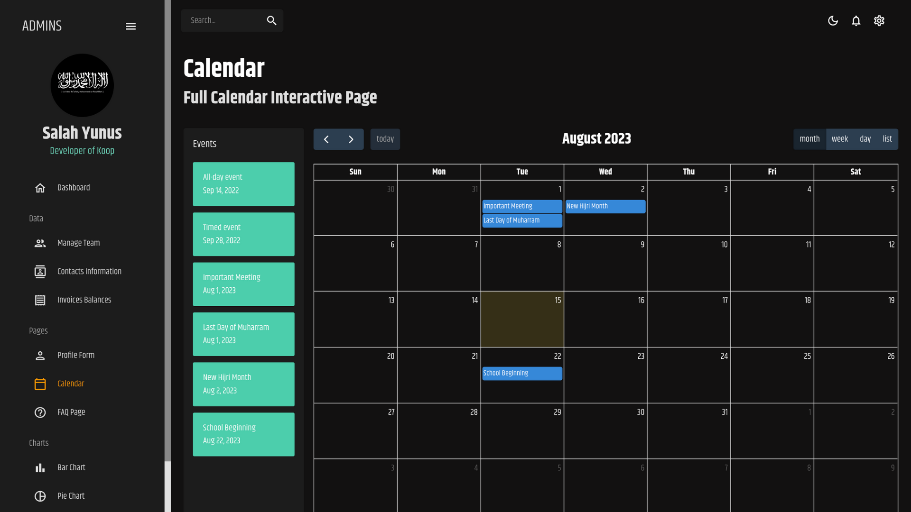
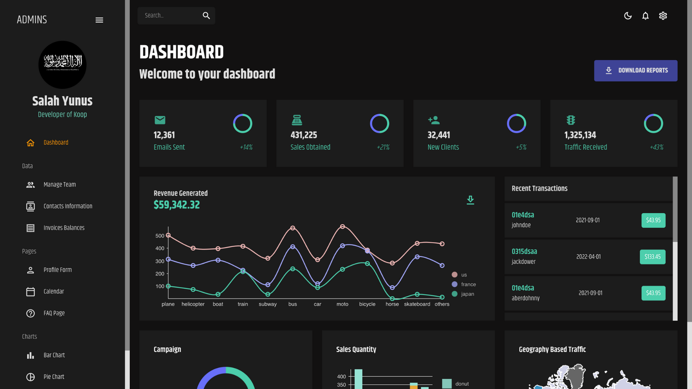

# Koop - business management

Welcome to Koop, business management like drinking water


## Table of Contents

- [Overview](#overview)
- [Features](#features)
- [Installation](#installation)
- [Technologies Used](#technologies-used)
- [Contributing](#contributing)
- [License](#license)
- [Contact](#contact)
- [Screenshots](#screens)

## Overview

Koop: Empower your management tasks with ease using this sleek admin dashboard built with React and MUI. Seamlessly handle data with Data Grid while toggling between Light & Dark Mode for enhanced visibility. Streamline your operations and make data-driven decisions efficiently with Koop's intuitive interface.

## Features

- Detailed comments for every line (for beginners).
- Dynamic UI brought to another level.
- Extremely advanced CSS selectors.
- Completely Responsive, Customizable, Modular design.
- Dark/Dim/Light Modes support with different color themes.
- Dunamically updated favicon according to color theme.
- Easy user-friendly admin dashboard interface
- User authentication and account management.
- Effortless navigation using React Router.
- Readable code with best practices and optimisation.

## Installation

1. Clone the repository:

```bash
git clone https://github.com/salahyunus/koop.git
```

2. Navigate to the project directory:

```bash
cd koop
```

3. Ibstall Dependencies

```bash
npm install
```

Finally:

```bash
npm start
```

## Technologies Used

- Core:
- [](https://skillicons.dev)
- Base:
- 
- Navigation:
- 
- Styling:
- [](https://skillicons.dev)
- Charts:
- Nivo

## Contributing

I heartily welcome contributions from the community! To contribute to Tijara:

1. Fork the repository.
2. Create a new branch for your feature or bug fix: git checkout -b feature-name
3. Make your changes and commit: git commit -m "Add feature"
4. Push to your branch: git push origin feature-name
5. reate a pull request detailing your changes.

## License

This project is licensed under the MIT License.

## Contact

For any inquiries or assistance, please reach out to me at salahyunusnew@gmail.com

## SCREENSHOTS!

- 
- 
- 
- 
- 
- 
